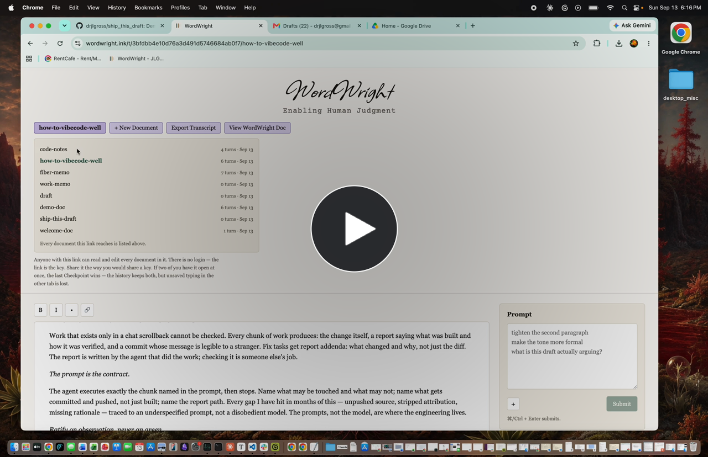

# ship_this_draft

An agent that takes a finished document out of [WordWright](https://wordwright.ink)
— a collaborative human-AI writing tool with attributed, append-only edit
history — and decides what happens to it next. It reads the draft and its full
edit ledger over the API, uses Claude to judge whether the document is actually
done and where it naturally belongs, and routes it there: **GitHub**, **Google
Drive**, or **Gmail**. A human confirms every route before anything ships, and
the human holds send.

Built on **Sunday, September 13, 2026** for the Lemma / Comma Capital Multi-App
AI Agent Hackathon. Every commit in this repo is from that day; the agent's own
test runs are visible in the history as `Ship <slug>: N turns...` commits.

**Demo (3 min 24 s)** — click the still to play the walkthrough:

[](https://github.com/drjlgross/ship_this_draft/raw/main/demo_footage/demo-master-full.mp4)

<sub>MP4, 30 MB, committed at `demo_footage/demo-master-full.mp4`.</sub>

## What it connects to (5 external apps)

| App | Role | How |
|---|---|---|
| **WordWright** | Source of documents + attributed edit history | REST API (capability token) |
| **Anthropic (Claude)** | Judgment: readiness + routing | Messages API, strict JSON contract |
| **GitHub** | Destination: work products worth version control | REST contents API (fine-grained PAT) |
| **Google Drive** | Destination: documents a human stores or hands over | Drive API, `drive.file` scope |
| **Gmail** | Destination: correspondence | Gmail API, `gmail.compose` scope — creates **drafts only, never sends** |

## Architecture: judgment and execution are deliberately separated

The model makes exactly the decisions that require reading unstructured
content — *is this document finished? where does it naturally belong?* —
and returns them through a strict contract: typed JSON, an enum of channels, a
fail-loud parse, no retries. Everything downstream is deterministic, testable
code. Everything irreversible (send, override) is held by the human.

Flow per run (`node ship.js <slug>`):

1. Fetch the document + ledger from WordWright.
2. Claude reviews it: `{ ready, reasons[], channel, second_channel }`.
3. The verdict and reasons print; the human greenlights, edits the channel
   set, or declines. A hold can be overridden — the human outranks the model —
   and overrides are printed as such. If Gmail is chosen, the human supplies
   the recipient (default: the operator's own address).
4. Deterministic dispatch to the chosen channels only. Each channel's output
   is self-contained: the email body IS the letter (no pipeline metadata, no
   attachment); the git commit message carries the ledger citation (slug, turn
   count, last-turn timestamp) — provenance native to each medium.

## How we know it works

This project's method is maker/checker: Claude Code built each chunk against a
written contract; a separate model checked reports against artifacts; a commit
means **I observed behavior working**, not that tests passed.
`reports/chunk-1..3.md` document what was built and how it was verified,
including one full reviewer JSON per test document.

Observed behavior across four seeded documents (terminal output in the demo):

| Document | Reviewer verdict | Outcome |
|---|---|---|
| Thank-you card | ready → **gmail** | Draft created, letter as body, unsent |
| Code notes | ready → **github** | Committed with ledger citation |
| Reflective essay | ready → **drive** (+argued github as second) | Human overrode to drive only |
| Half-finished memo | **not ready** — named the three price placeholders and the placeholder conclusion | **Nothing shipped** |

Verification practices, all reproducible from this repo:

- **Converter** (`md-to-docx.js`): verified against docx XML directly — a
  fixture exercising headings/bold/italic/lists/links was converted, unzipped,
  and style refs / `<w:b/>` / `<w:numPr>` entries counted (chunk-1 report).
- **Shipped bytes**: SHA-256 of the GitHub copy matched the locally generated
  file.
- **No send path**: `grep -rn "\.send" *.js` returns nothing. The Gmail code
  calls `users.drafts.create` only. Scopes are pinned in `google-client.js`
  (two lines — go look).
- **Least-privilege credentials**: GitHub PAT scoped to this single repo;
  Google OAuth in test mode with `drive.file` (only files this app creates)
  and `gmail.compose`; WordWright access via an isolated demo namespace; the
  Anthropic key is the operator's (the agent's brain runs on the operator's
  account, mirroring the substrate's own design). No secret is tracked;
  `.gitignore` predates all code.
- **Substrate findings were logged, not patched**: testing surfaced real bugs
  in WordWright (a ledger-narration misattribution when canonicalization
  strips an entire model edit — diagnosed via the ledger's own warnings
  channel — and a partial-application case on a global edit). WordWright's
  main was frozen for the hackathon; findings are documented for post-hack
  fixes rather than rushed in under a deadline.

## Known limitations (stated, not hidden)

- The reviewer assesses **content readiness, not rendering fidelity**. A
  document with formatting artifacts can ship as "ready" (observed once;
  rendering is verified upstream and caught downstream by the human read).
- Recipient addresses are not validated before the API call; a malformed
  address fails loud at Gmail rather than at the prompt.
- Subjects derived from document content are not MIME-encoded; a non-ASCII
  heading would go into the header raw.
- Re-shipping the same slug within the same minute hits an existing GitHub
  path and fails loud (422) rather than overwriting — by design, but a
  demo-day footgun.
- `gmail.compose` technically includes the ability to send drafts; this code
  contains no send call (verifiable above), and the token is revocable in one
  click at myaccount.google.com/permissions.

## Run it

Node 24. `npm ci`, then create `.env` from `.env.example`:

```
WORDWRIGHT_TOKEN=   # WordWright namespace capability token
WORDWRIGHT_SLUG=    # default document slug
GITHUB_TOKEN=       # fine-grained PAT, Contents:RW, this repo only
GITHUB_REPO=        # owner/name
ANTHROPIC_API_KEY=  # operator's key; used for the review call only (claude-sonnet-4-6)
SHIP_NOTIFY_EMAIL=  # default recipient for gmail routes
```

Google setup (one time): a GCP project with Drive + Gmail APIs enabled, an
OAuth consent screen in **Testing** with yourself as test user, a Desktop-app
OAuth client whose JSON sits in the repo root (gitignored). Then:

```
node auth.js          # one-time browser consent; writes token.json (0600)
node ship.js <slug>   # review → greenlight → dispatch
```

`--yes` auto-accepts the recommendation (never an override).

## License

MIT.
